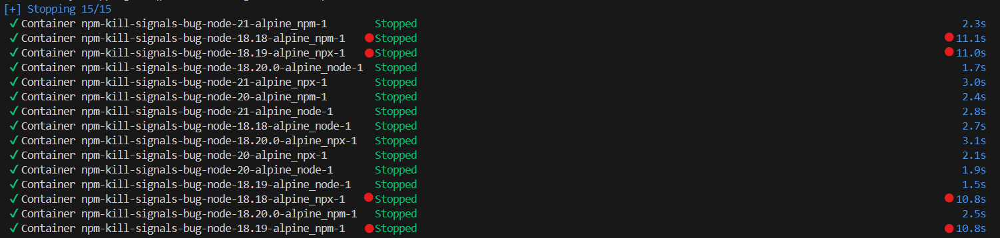

# npm signals bug

This is a demo repo to show a bug in npm where signals are not forwarded to the underlying process: 

[https://github.com/npm/cli/issues/6684](https://github.com/npm/cli/issues/6684)

This bug appears in NPM `>=9.6.7 <10.3.0`.

## How this works

We have a single entrypoint at `src/index.js` which sets a long timer and clears the timer whenever a kill signal is received. We execute this file using 3 different techniques:

1. `node ./src/index.js`
2. `npm start` (executes the same command above)
3. `npx -y tsx ./src/index.js`

## Using this repo

We use docker compose to execute each of the above commands in multiple versions of node with different versions of npm. Docker will send SIGTERM to all services when you stop the cluster. Docker will forceably terminate any process which hasn't gracefully exited after ~10s.

```bash
docker compose up 
# Then stop it using CTRL + C
```
...or

```bash
docker compose up -d
docker compose stop
```



## Synopsis

- Running a process directly with `node ...` works as expected in all scenarios.
- Any version of npm `>=9.6.7 <10.3.0` will show the bug when you start the process with `npm` or `npx` executables.
